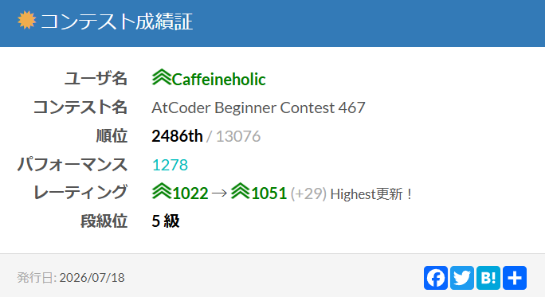

## 記事を執筆しました

大学の競技プログラミングサークル**WCPC**で後悔しているホームページで、ABC参加記を執筆しましたので是非ご覧ください。
結果を画像で貼ることにしました。

## 今回の感想

A、B問題は簡単でした。C問題が解けない！と焦ったものの、「値を固定して部分問題を考える」という動きをまだ試していないことに気づきました。
気づいてからは早かったです。数列に実際に操作を加える方法を検討するという見方から一歩引いて、操作後の数列がどうなりうるかを考えると解ける、最近は出ていないタイプの問題でしょうか。
クエリの実行速度を工夫で埋めるタイプのC問題が得意というか解いていて楽しい私ですが、こういうタイプの問題にも順応していきたいです。

D問題は、数学の知識が必要な問題だったというよりは、円の半径を変えていったとき中心の軌跡がどうなるかをビジュアライズできるかにかかっていたと思います。
頭の中で解けた後は、どうやって直線の方程式を表現するかとどうやって方程式同士を比較するかに時間をかけました。手元で一般形に変形できたら各項を比較するだけでしたが、競プロを練習するうえで練習が優先されるものではないと思います。
したことのない操作はどうしても書くのに時間がかかります。

今回はE問題以降が難しすぎて助かった形です。来週も出られそうなので、頑張りますよ。

## 関連リンク

[AtCoder](https://atcoder.jp) 
[WCPC公式HP](https://wcpc.pages.dev/)  
[執筆した記事(ABC454参加記)](https://wcpc.pages.dev/activities/abc467-log/)
